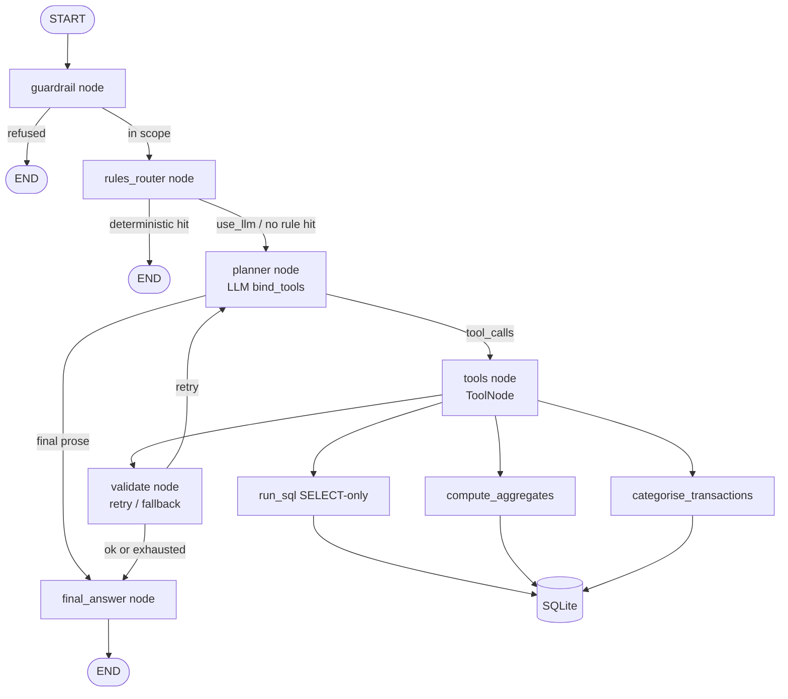

# Finance AI Agent

**Author:** Kiran Chundu · B.Tech CSE, NIT Warangal (2025)

A **personal finance agent** that answers questions about bank transactions using **tool calling** (read-only SQL, aggregates, categorisation), with **guardrails** for SQL safety and out-of-scope refusal. Built with a LangGraph-style agent loop and a provider-agnostic LLM layer.

> **Data note:** The bundled statement is **100% synthetic**. Every description is prefixed with `[SYNTHETIC]`. Do not treat it as real financial data.

---

## What it does

1. Ingest bank-statement CSVs into **SQLite**.
2. Categorise merchants with **rule-based patterns** (+ optional LLM fallback).
3. Answer questions via tools: validated **SELECT-only SQL**, pre-built **aggregates**, and **categorise**.
4. Refuse out-of-scope / unsafe requests.
5. Expose **FastAPI** `POST /chat` and a **Typer CLI**.

---

## Architecture

Real **LangGraph** `StateGraph` (not a hand-rolled loop):



---

## Tech stack

| Layer | Choice |
|-------|--------|
| Agent | LangGraph `StateGraph` (guardrail → rules → planner ⇄ tools → validate → final) |
| LLM | Gemini / OpenAI / Anthropic (env-selected) |
| DB | SQLite |
| API | FastAPI |
| CLI | Typer + Rich |
| Data | Synthetic CSV generator (300 txns) |
| Tests | pytest with mock LLM |

---

## Setup

```bash
git clone https://github.com/chundukiran11/finance-ai-agent.git
cd finance-ai-agent
python -m venv .venv && source .venv/bin/activate
pip install -r requirements.txt
cp .env.example .env
export PYTHONPATH=src
```

---

## Usage

```bash
# Generate synthetic data (already bundled; regenerate anytime)
python -m finance_agent generate-data --n 300

# Ingest into SQLite
python -m finance_agent ingest data/synthetic_statement.csv

# Categorise any null categories
python -m finance_agent categorise

# Ask questions (offline rule router; no API key)
python -m finance_agent chat "How much did I spend in total?"
python -m finance_agent chat "Give me a spending summary by category"
python -m finance_agent chat "Tell me a joke"   # refused

# Live LLM tool-calling (needs API key)
python -m finance_agent chat "What were my top expenses last month?" --use-llm --no-mock

# Evaluate rule-based categorisation accuracy (no LLM)
python -m finance_agent evaluate

# Serve API
python -m finance_agent serve
```

### API

```bash
curl -X POST http://localhost:8001/chat \
  -H 'Content-Type: application/json' \
  -d '{"message":"Give me a spending summary by category"}'
```

### Docker

```bash
docker build -t finance-ai-agent .
docker run --env-file .env -p 8001:8001 finance-ai-agent
```

---

## Example output

```text
route=rules
──────────
Spending by category:
- rent: total=-1800.0, spending=-1800.0, n=12
- groceries: total=-1842.33, spending=-1842.33, n=25
...
```

---

## Results

| Metric | Value | How measured |
|--------|-------|--------------|
| Rule-based categorisation accuracy | **1.0 (300/300)** | Exact match of `categorise_description(description)` vs ground-truth `category` column on all 300 synthetic rows. Measured 2026-09-24 IST. **No LLM.** |
| Agent Q&A accuracy | *Not run* | Run `python -m finance_agent evaluate --with-llm` after configuring an API key. |

To reproduce:

```bash
export PYTHONPATH=src
python -m finance_agent evaluate
# writes eval/last_report.json
```

---

## Project layout

```text
finance-ai-agent/
├── src/finance_agent/
│   ├── llm/           # Provider-agnostic LLM factory
│   ├── db/            # Schema, CSV ingest, synthetic generator
│   ├── tools/         # SQL guardrails, aggregates, categoriser
│   ├── agent/         # FinanceAgent (rules + LLM tool loop)
│   ├── api/           # FastAPI /chat
│   ├── cli.py
│   └── evaluate.py
├── data/synthetic_statement.csv
├── eval/
├── tests/
└── STUDY_GUIDE.md
```

---

## License

MIT © Kiran Chundu
